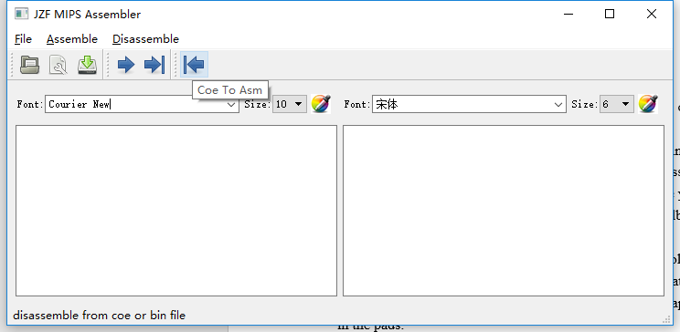
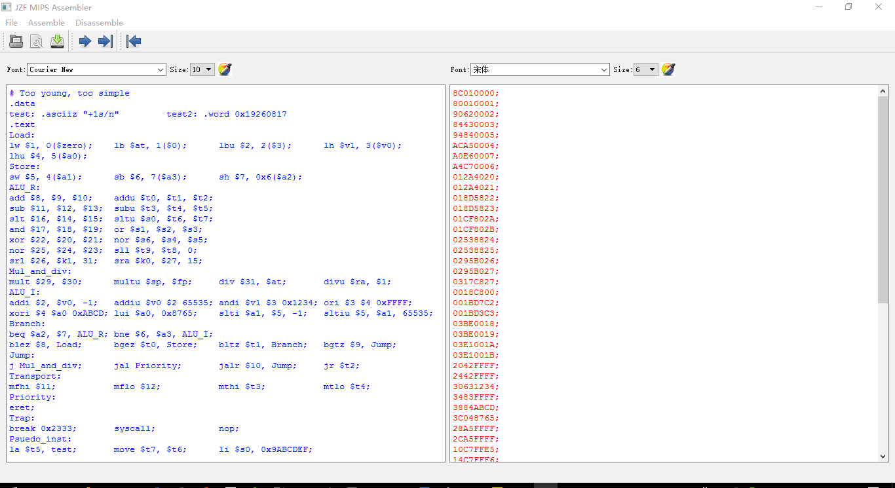
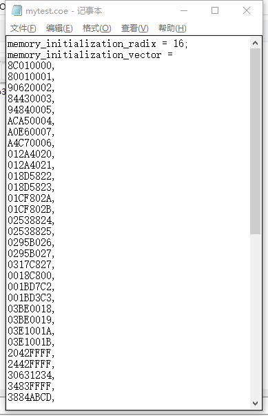
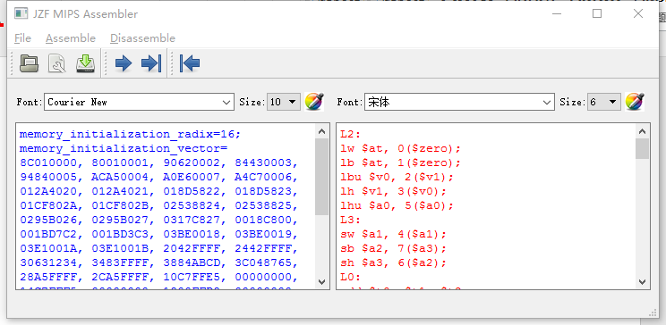

# 1. OVERVIEW
*MISP Assembler and Disassembler*, as its name reveals, is a **functional interpreter that involves assembly language** in **MIPS** architecture.
As a homework assigned in the **computer organization** course for sophomore majoring in CS,
it is an **individual project** for **non-comercial** purposes.
This system allows you to translate MIPS codes into binary ones or coe codes, 
and vice versa.  

  

# 2. FUNCTIONS  
Following these three formats of files are supported to be translasted into one another:  

| Postfix | Description |
|:-:|:-:|
| coe | Codes that initialize the memory IP-core in Xilinx ISE |
| bin | Executive code stream on Xilinx FPGA |
| asm | MIPS assembly language code |  

Following chapter will discuss these functions in detail.  

# 3. USAGE
Make sure that the consistence of relative paths among all the folders.
## The hierarchy of the file
- images: images for Readme
- source: source code and other raw material

## How to build the project
Build by VS with Qt 5.8.0 kits or a proper Qt creator.

## Detail direction:
### Assemble
#### ASM to COE
If you want to assemble a asm file into a new coe file, do as the basic instruction:  
* Click Open asm or coe in the Open menu, or simply click the corresponding button, or Ctrl + O. 
You can also directly type in the left text pad, not opening any file at all, as long as what your have typed can be assembled.
*	You will have a dialog box to choose the file you want.
* Click To coe in the Assemble menu, or simply click the corresponding button.
*	You will have a dialog box to choose the location where you can save your work. If you don’t want to save the coe file, you can simply 
cancel it. Next time when you want to save the coe file, you have to assemble the asm file again to meet again with the dialog box.
No matter whether you will save it or not, the immediate result will be print in the right text pad.( Note that the prefix of a 
acutal coe file is ommited)  
  
In terms of the grammar, you can refer to a standard MIPS asm file. All the instructions can be assembled in the standard form as long 
as they are supported by my program.
In addition, these grammars are available:  
* You can use numeric name or common name for any register.
* If you guarantee there is at least one seperator between any of two parts in an instruction, then any amount of extra “ ” “,” “;” 
“\n” “\t” among any two adjacent part in an instruction is acceptable. For example, even a “add , $1 $2,,	$3;;” is acceptable.
*You can write the immediate number in decimal form or hexidemal form( which must be started with “0x”), so is case with the offset 
number you use in Load or Store instructions.
* You can have comments in a line once they are started with “#”;  
All the operation you can assemble (53 in all) and all the form you can write with your asm file can be found in the sample 
provided as follows, as well as the result of the assembling:

  
  
And the coe file you can get is like this:  
  

#### ASM to BIN
If you want to assemble a asm file into a new bin file, do as the basic instruction:  
* Click Open asm or coe in the Open menu, or simply click the corresponding button, or Ctrl + O. 
You can also directly type in the left text pad, not opening any file at all, as long as what your have typed can be assembled.
*	You will have a dialog box to choose the file you want.
* Click To bin in the Assemble menu, or simply click the corresponding button.
*	You will have a dialog box to choose the location where you can save your work. If you don’t want to save the bin file, 
you can simply cancel it. Next time when you want to save the bin file, you have to assemble the asm file again to meet again 
with the dialog box.  
No matter whether you will save it or not, the immediate result will be print in the right text pad.  

Notice that the bin file you get from our program can use Zhang Hai’s program to disassemble, so you can also test whether 
this function works or not.  
Also, the bin file can also be disassembled by our program.  

### Disassemble
#### COE to ASM
If you want to disassemble a coe file into a new asm file, do as the basic instruction:  
* Click Open asm or coe in the Open menu, or simply click the corresponding button, or Ctrl + O. 
You can also directly type in the left text pad, not opening any file at all, as long as what your have typed can be assembled.
*	You will have a dialog box to choose the file you want.
* Click Coe to asm in the Assemble menu, or simply click the corresponding button.
*	You will have a dialog box to choose the location where you can save your work. If you don’t want to save the asm file, 
you can simply cancel it. Next time when you want to save the asm file, you have to disassemble the coe file again to meet 
again with the dialog box.  
No matter whether you will save it or not, the immediate result will be print in the right text pad.  
Our program supports to disassemble all the instructions you can get from our assemble part. 
(Data definition not included) What you can obtain is possibly like this:  

  
*p.s. Note that the labels’ names are auto-made like “L0” “L1” and so on.*  

#### BIN to ASM
f you want to disassemble a bin file into a new asm file, do as the basic instruction:  
* Click Open asm or coe in the Open menu, or simply click the corresponding button.
*	You will have a dialog box to choose the file you want.
*	Then the bin file will be read and turnt into readable form, which can be seen 
in the left text pad.
* Also click Coe to asm in the Assemble menu, or simply click the corresponding button.
*	You will have a dialog box to choose the location where you can save your work. If you don’t want to save the asm file, 
you can simply cancel it. Next time when you want to save the asm file, you have to disassemble the coe file again to 
meet again with the dialog box.
No matter whether you will save it or not, the immediate result will be print in the right text pad.  

Note that you can also disassemble what Zhang Hai’s program has assembled. 
In other words, we share the same form of binary file format.  

# 4. LICENCE
The content of all the codes are supposed to use a licence [AGPLv3](./LICENCE)  

# 5. HOW TO CONTRIBUTE
1. Learn what is a AGPLv3, if you have not yet done so (see details above).  
2.  Create your change to the repo in question.
- Fork the desired repo, develop and test your code changes.
- Ensure that your code is clear and comprehensible.
- Ensure that your code has an appropriate set of unit tests which all pass.
3. Submit a pull request.
4. The repo owner will review your request. If it is approved, the change will be merged. If it needs additional work, the repo owner will respond with useful comments.

# 6. CREDIT
First of all, I would like to extend my sincere gratitude to my supervisor, Xiaohong Jiang, for her instructive advice and useful suggestions on my learning on computer organization.
I am also deeply grateful of Zhe Pan, the TA's help in the completion and assessment of this project.  
High tribute shall be paid to Shuai Cheng, whose profound knowledge of Qt libraries helps my compiling for this brilliant project.  
